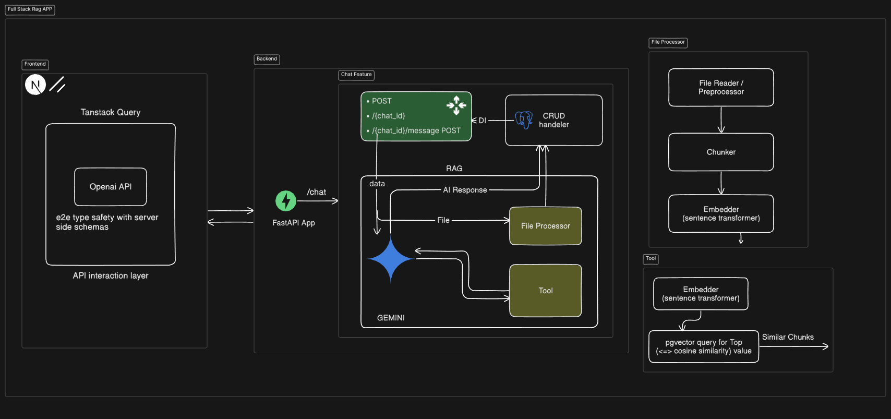
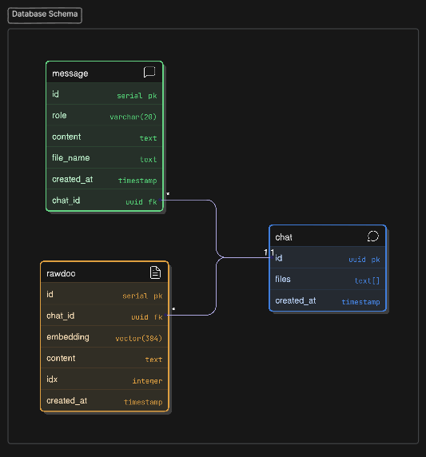

# Project Title

This project is a web application that implements a Retrieval-Augmented Generation (RAG) system using Python, FastAPI, Next.js, and TypeScript. It integrates with Google GenAI for generative AI capabilities and uses PostgreSQL for data storage along with pgvector extension for vector data.

In this project i haven't used any high level RAG frameworks and database ORM's in order to provide a clear understanding of the underlying mechanics of RAG systems.

## Project Structure

The project is organized into two main directories:

- **`api/`**: The backend application built with Python and FastAPI. It handles data processing, RAG logic, and communicates with the AI models and database.
- **`web/`**: The frontend application built with Next.js and TypeScript. It provides the user interface for interacting with the system.

## Technologies Used

### Backend (`/api`)

- **Python**: Core programming language.
- **FastAPI**: Modern, fast web framework for building APIs.
- **Google GenAI**: Integration with Google's generative AI models.
- **Sentence Transformers**: For generating text embeddings.
- **PostgreSQL**: Database for vector and relational data storage (via `psycopg`).
- **PyPDF**: For parsing PDF documents.
- **uv**: Fast Python package installer and resolver.

### Frontend (`/web`)

- **Next.js**: React framework for the web.
- **OpenApi Generator**: For generating API client code.
- **Tanstack Query**: Data fetching and state management.
- **TypeScript**: Static type checking.
- **pnpm**: Fast, disk-space efficient package manager.

## Getting Started

### Prerequisites

- Node.js & pnpm
- Python 3.13+ & uv
- PostgreSQL instance

### 1. Backend Setup

Navigate to the `api` directory:

```bash
cd api
```

Install dependencies:

```bash
# Using uv (recommended)
uv sync
```

Create a `.env` file in the `api` directory with the necessary environment variables.
An example `.env` file is provided in the `api` directory.

Run database migrations to set up the PostgreSQL database schema:

```bash
uv run migration.py
```

Run the development server:

```bash
fastapi dev main.py
```

### 2. Frontend Setup

Navigate to the `web` directory:

```bash
cd web
```

Install dependencies:

```bash
pnpm install
```

Run the development server:

```bash
pnpm dev
```

Open [http://localhost:3000](http://localhost:3000) with your browser to see the result.

## Architecture



**Key Decisions:**

1. **psycopg instead of SQLAlchemy**: Lightweight and direct interaction with PostgreSQL without the overhead of an ORM. Perfect for understanding raw SQL operations as well as scope of the project.
2. **sentence-transformers**: Lightweight as Compared to other embedding models, 384-d vector embedding is sufficient for semantic similarity without burning a lot of compute resources.
3. **tool calling**: Gemini calls the readfile tool which accepts a list of queries, and similar chunks are retrieved based upon cosine similarity of query and chunk embeddings. this way, the system can handle ambiguity and provide a more accurate response.

## RAG Pipeline

The RAG pipeline in this project consists of the following 2 main components:

1. **Document Preprocessing**: PDF documents are parsed using PyPDF to extract text content, null bytes are removed, and for the files other than PDFs, text is read directly using normal file read operations.
2. **Chunking**: The text content is chunked into smaller chunks (default 2000) with overlapping characters (default 200) to ensure that each chunk contains a sufficient amount of context for GEMINI to generate a response.
3. **Embedding**: The chunked text content is embedded sentence transformers model using the all-MiniLM-L6 vector model which generates 384-dimensional vectors.
4. **Storage**: The generated embeddings along with the original text chunks and index of chunk are stored in a PostgreSQL database using the pgvector extension.
5. **Retrieval**: The embeddings are used to retrieve the similar chunks based on cosine similarity value to the embeddings of the user's question. The retrieved chunks are then used to generate a response using GEMINI.

## Database Schema

The database schema Can be found in the `api/migration.py` file. It includes tables for storing rawdocument data, chat session and chat messages.



**Tables:**

1. `chat`: Stores the chat sessions and their associated files.

2. `message`: Stores the chat messages, i.e user queries and AI responses.  

3. `rawdoc`: Stores the raw document data along with the embeddings and the index of the chunk.

Note: Output schemas can be found in the `api/feature/schemas.py` file.
